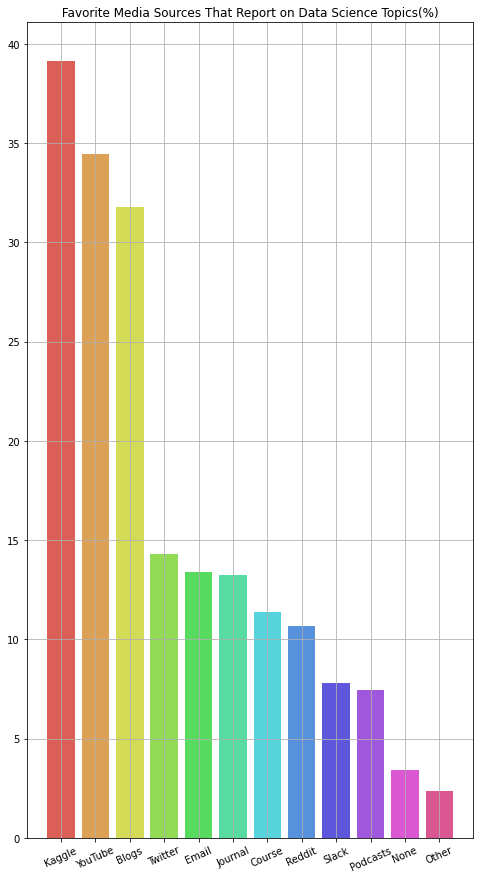

```python
# This Python 3 environment comes with many helpful analytics libraries installed
# It is defined by the kaggle/python Docker image: https://github.com/kaggle/docker-python
# For example, here's several helpful packages to load

import numpy as np # linear algebra
import pandas as pd # data processing, CSV file I/O (e.g. pd.read_csv)

# Input data files are available in the read-only "../input/" directory
# For example, running this (by clicking run or pressing Shift+Enter) will list all files under the input directory

import os
for dirname, _, filenames in os.walk('/kaggle/input'):
    for filename in filenames:
        print(os.path.join(dirname, filename))

# You can write up to 20GB to the current directory (/kaggle/working/) that gets preserved as output when you create a version using "Save & Run All" 
# You can also write temporary files to /kaggle/temp/, but they won't be saved outside of the current session
```

    /kaggle/input/kaggle-survey-2020/kaggle_survey_2020_responses.csv
    /kaggle/input/kaggle-survey-2020/supplementary_data/kaggle_survey_2020_methodology.pdf
    /kaggle/input/kaggle-survey-2020/supplementary_data/kaggle_survey_2020_answer_choices.pdf
    

# 시작하기
kaggle에서 kaggle-survey-2020 data를 받은 후 살펴보기로 합시다. 파일은 하나밖에 없지만, 여러 파일을 불러와 concatenate하는 코드가 더 확장성이 있을 것 같아

glob을 import하고 total이라는 DataFrame 객체에 데이터를 저장합니다. 


```python
import glob

path = r'/kaggle/input/kaggle-survey-2020' 
all_files = glob.glob(path + r"/*.csv")

total = pd.DataFrame()


for file_name in all_files:

  temp = pd.read_csv(file_name, sep=',', dtype='str')

  total = pd.concat([total, temp], axis=0)

print(total.info())
total.head()

```

    <class 'pandas.core.frame.DataFrame'>
    RangeIndex: 20037 entries, 0 to 20036
    Columns: 355 entries, Time from Start to Finish (seconds) to Q35_B_OTHER
    dtypes: object(355)
    memory usage: 54.3+ MB
    None
    


<div>
<style scoped>
    .dataframe tbody tr th:only-of-type {
        vertical-align: middle;
    }

    .dataframe tbody tr th {
        vertical-align: top;
    }

    .dataframe thead th {
        text-align: right;
    }
</style>
<table border="1" class="dataframe">
  <thead>
    <tr style="text-align: right;">
      <th></th>
      <th>Time from Start to Finish (seconds)</th>
      <th>Q1</th>
      <th>Q2</th>
      <th>Q3</th>
      <th>Q4</th>
      <th>Q5</th>
      <th>Q6</th>
      <th>Q7_Part_1</th>
      <th>Q7_Part_2</th>
      <th>Q7_Part_3</th>
      <th>...</th>
      <th>Q35_B_Part_2</th>
      <th>Q35_B_Part_3</th>
      <th>Q35_B_Part_4</th>
      <th>Q35_B_Part_5</th>
      <th>Q35_B_Part_6</th>
      <th>Q35_B_Part_7</th>
      <th>Q35_B_Part_8</th>
      <th>Q35_B_Part_9</th>
      <th>Q35_B_Part_10</th>
      <th>Q35_B_OTHER</th>
    </tr>
  </thead>
  <tbody>
    <tr>
      <th>0</th>
      <td>Duration (in seconds)</td>
      <td>What is your age (# years)?</td>
      <td>What is your gender? - Selected Choice</td>
      <td>In which country do you currently reside?</td>
      <td>What is the highest level of formal education ...</td>
      <td>Select the title most similar to your current ...</td>
      <td>For how many years have you been writing code ...</td>
      <td>What programming languages do you use on a reg...</td>
      <td>What programming languages do you use on a reg...</td>
      <td>What programming languages do you use on a reg...</td>
      <td>...</td>
      <td>In the next 2 years, do you hope to become mor...</td>
      <td>In the next 2 years, do you hope to become mor...</td>
      <td>In the next 2 years, do you hope to become mor...</td>
      <td>In the next 2 years, do you hope to become mor...</td>
      <td>In the next 2 years, do you hope to become mor...</td>
      <td>In the next 2 years, do you hope to become mor...</td>
      <td>In the next 2 years, do you hope to become mor...</td>
      <td>In the next 2 years, do you hope to become mor...</td>
      <td>In the next 2 years, do you hope to become mor...</td>
      <td>In the next 2 years, do you hope to become mor...</td>
    </tr>
    <tr>
      <th>1</th>
      <td>1838</td>
      <td>35-39</td>
      <td>Man</td>
      <td>Colombia</td>
      <td>Doctoral degree</td>
      <td>Student</td>
      <td>5-10 years</td>
      <td>Python</td>
      <td>R</td>
      <td>SQL</td>
      <td>...</td>
      <td>NaN</td>
      <td>NaN</td>
      <td>NaN</td>
      <td>TensorBoard</td>
      <td>NaN</td>
      <td>NaN</td>
      <td>NaN</td>
      <td>NaN</td>
      <td>NaN</td>
      <td>NaN</td>
    </tr>
    <tr>
      <th>2</th>
      <td>289287</td>
      <td>30-34</td>
      <td>Man</td>
      <td>United States of America</td>
      <td>Master’s degree</td>
      <td>Data Engineer</td>
      <td>5-10 years</td>
      <td>Python</td>
      <td>R</td>
      <td>SQL</td>
      <td>...</td>
      <td>NaN</td>
      <td>NaN</td>
      <td>NaN</td>
      <td>NaN</td>
      <td>NaN</td>
      <td>NaN</td>
      <td>NaN</td>
      <td>NaN</td>
      <td>NaN</td>
      <td>NaN</td>
    </tr>
    <tr>
      <th>3</th>
      <td>860</td>
      <td>35-39</td>
      <td>Man</td>
      <td>Argentina</td>
      <td>Bachelor’s degree</td>
      <td>Software Engineer</td>
      <td>10-20 years</td>
      <td>NaN</td>
      <td>NaN</td>
      <td>NaN</td>
      <td>...</td>
      <td>NaN</td>
      <td>NaN</td>
      <td>NaN</td>
      <td>NaN</td>
      <td>NaN</td>
      <td>NaN</td>
      <td>NaN</td>
      <td>NaN</td>
      <td>None</td>
      <td>NaN</td>
    </tr>
    <tr>
      <th>4</th>
      <td>507</td>
      <td>30-34</td>
      <td>Man</td>
      <td>United States of America</td>
      <td>Master’s degree</td>
      <td>Data Scientist</td>
      <td>5-10 years</td>
      <td>Python</td>
      <td>NaN</td>
      <td>SQL</td>
      <td>...</td>
      <td>NaN</td>
      <td>NaN</td>
      <td>NaN</td>
      <td>NaN</td>
      <td>NaN</td>
      <td>NaN</td>
      <td>NaN</td>
      <td>NaN</td>
      <td>NaN</td>
      <td>NaN</td>
    </tr>
  </tbody>
</table>
<p>5 rows × 355 columns</p>
</div>


약 20000개의 row와 355개의 column이 있는 것을 확인했습니다. column자체는 문제 번호를 의미하고 1번째 행(idx=0)에 질문이 쓰여 있습니다.

이 질문들을 살펴보겠습니다. 질문이 길고, 그 수가 많아서 옵션을 세부지정해서 출력합니다.

신상정보에 대한 질문과 주로 사용하는 Framework, 향후 익숙해지고 싶은 툴 등 총 39개의 질문으로 이루어져 있습니다. 다중선택을 분리해 놓아 column의 수가 많이 늘어났습니다


```python
with pd.option_context('display.max_rows', None, 'display.max_columns', None, 'display.max_colwidth', 20000, 'display.expand_frame_repr', True):  # more options can be specified also
    print(total.iloc[0,:])
```

    Time from Start to Finish (seconds)                                                                                                                                                                                                                                                      Duration (in seconds)
    Q1                                                                                                                                                                                                                                                                                 What is your age (# years)?
    Q2                                                                                                                                                                                                                                                                      What is your gender? - Selected Choice
    Q3                                                                                                                                                                                                                                                                   In which country do you currently reside?
    Q4                                                                                                                                                                                             What is the highest level of formal education that you have attained or plan to attain within the next 2 years?
    Q5                                                                                                                                                                                                     Select the title most similar to your current role (or most recent title if retired): - Selected Choice
    Q6                                                                                                                                                                                                                                           For how many years have you been writing code and/or programming?
    Q7_Part_1                                                                                                                                                                                         What programming languages do you use on a regular basis? (Select all that apply) - Selected Choice - Python
    Q7_Part_2                                                                                                                                                                                              What programming languages do you use on a regular basis? (Select all that apply) - Selected Choice - R
    Q7_Part_3                                                                                                                                                                                            What programming languages do you use on a regular basis? (Select all that apply) - Selected Choice - SQL
    Q7_Part_4                                                                                                                                                                                              What programming languages do you use on a regular basis? (Select all that apply) - Selected Choice - C
    Q7_Part_5                                                                                                                                                                                            What programming languages do you use on a regular basis? (Select all that apply) - Selected Choice - C++
    Q7_Part_6                                                                                                                                                                                           What programming languages do you use on a regular basis? (Select all that apply) - Selected Choice - Java
    Q7_Part_7                                                                                                                                                                                     What programming languages do you use on a regular basis? (Select all that apply) - Selected Choice - Javascript
    Q7_Part_8                                                                                                                                                                                          What programming languages do you use on a regular basis? (Select all that apply) - Selected Choice - Julia
    Q7_Part_9                                                                                                                                                                                          What programming languages do you use on a regular basis? (Select all that apply) - Selected Choice - Swift
    Q7_Part_10                                                                                                                                                                                          What programming languages do you use on a regular basis? (Select all that apply) - Selected Choice - Bash
    Q7_Part_11                                                                                                                                                                                        What programming languages do you use on a regular basis? (Select all that apply) - Selected Choice - MATLAB
    Q7_Part_12                                                                                                                                                                                          What programming languages do you use on a regular basis? (Select all that apply) - Selected Choice - None
    Q7_OTHER                                                                                                                                                                                           What programming languages do you use on a regular basis? (Select all that apply) - Selected Choice - Other
    Q8                                                                                                                                                                                                  What programming language would you recommend an aspiring data scientist to learn first? - Selected Choice
    Q9_Part_1                                                                                                         Which of the following integrated development environments (IDE's) do you use on a regular basis?  (Select all that apply) - Selected Choice - Jupyter (JupyterLab, Jupyter Notebooks, etc) 
    Q9_Part_2                                                                                                                                             Which of the following integrated development environments (IDE's) do you use on a regular basis?  (Select all that apply) - Selected Choice -  RStudio 
    Q9_Part_3                                                                                                                  Which of the following integrated development environments (IDE's) do you use on a regular basis?  (Select all that apply) - Selected Choice -  Visual Studio / Visual Studio Code 
    Q9_Part_4                                                                                                                              Which of the following integrated development environments (IDE's) do you use on a regular basis?  (Select all that apply) - Selected Choice - Click to write Choice 13
    Q9_Part_5                                                                                                                                             Which of the following integrated development environments (IDE's) do you use on a regular basis?  (Select all that apply) - Selected Choice -  PyCharm 
    Q9_Part_6                                                                                                                                            Which of the following integrated development environments (IDE's) do you use on a regular basis?  (Select all that apply) - Selected Choice -   Spyder  
    Q9_Part_7                                                                                                                                         Which of the following integrated development environments (IDE's) do you use on a regular basis?  (Select all that apply) - Selected Choice -   Notepad++  
    Q9_Part_8                                                                                                                                      Which of the following integrated development environments (IDE's) do you use on a regular basis?  (Select all that apply) - Selected Choice -   Sublime Text  
    Q9_Part_9                                                                                                                                       Which of the following integrated development environments (IDE's) do you use on a regular basis?  (Select all that apply) - Selected Choice -   Vim / Emacs  
    Q9_Part_10                                                                                                                                             Which of the following integrated development environments (IDE's) do you use on a regular basis?  (Select all that apply) - Selected Choice -  MATLAB 
    Q9_Part_11                                                                                                                                                 Which of the following integrated development environments (IDE's) do you use on a regular basis?  (Select all that apply) - Selected Choice - None
    Q9_OTHER                                                                                                                                                  Which of the following integrated development environments (IDE's) do you use on a regular basis?  (Select all that apply) - Selected Choice - Other
    Q10_Part_1                                                                                                                                                       Which of the following hosted notebook products do you use on a regular basis?  (Select all that apply) - Selected Choice -  Kaggle Notebooks
    Q10_Part_2                                                                                                                                                         Which of the following hosted notebook products do you use on a regular basis?  (Select all that apply) - Selected Choice - Colab Notebooks
    Q10_Part_3                                                                                                                                                         Which of the following hosted notebook products do you use on a regular basis?  (Select all that apply) - Selected Choice - Azure Notebooks
    Q10_Part_4                                                                                                                                                 Which of the following hosted notebook products do you use on a regular basis?  (Select all that apply) - Selected Choice -  Paperspace / Gradient 
    Q10_Part_5                                                                                                                                                   Which of the following hosted notebook products do you use on a regular basis?  (Select all that apply) - Selected Choice -  Binder / JupyterHub 
    Q10_Part_6                                                                                                                                                            Which of the following hosted notebook products do you use on a regular basis?  (Select all that apply) - Selected Choice -  Code Ocean 
    Q10_Part_7                                                                                                                                                     Which of the following hosted notebook products do you use on a regular basis?  (Select all that apply) - Selected Choice -  IBM Watson Studio 
    Q10_Part_8                                                                                                                                               Which of the following hosted notebook products do you use on a regular basis?  (Select all that apply) - Selected Choice -  Amazon Sagemaker Studio 
    Q10_Part_9                                                                                                                                                  Which of the following hosted notebook products do you use on a regular basis?  (Select all that apply) - Selected Choice -  Amazon EMR Notebooks 
    Q10_Part_10                                                                                                                                    Which of the following hosted notebook products do you use on a regular basis?  (Select all that apply) - Selected Choice - Google Cloud AI Platform Notebooks 
    Q10_Part_11                                                                                                                                         Which of the following hosted notebook products do you use on a regular basis?  (Select all that apply) - Selected Choice - Google Cloud Datalab Notebooks
    Q10_Part_12                                                                                                                                   Which of the following hosted notebook products do you use on a regular basis?  (Select all that apply) - Selected Choice -  Databricks Collaborative Notebooks 
    Q10_Part_13                                                                                                                                                                   Which of the following hosted notebook products do you use on a regular basis?  (Select all that apply) - Selected Choice - None
    Q10_OTHER                                                                                                                                                                    Which of the following hosted notebook products do you use on a regular basis?  (Select all that apply) - Selected Choice - Other
    Q11                                                                                                                                                                                                    What type of computing platform do you use most often for your data science projects? - Selected Choice
    Q12_Part_1                                                                                                                                                                                Which types of specialized hardware do you use on a regular basis?  (Select all that apply) - Selected Choice - GPUs
    Q12_Part_2                                                                                                                                                                                Which types of specialized hardware do you use on a regular basis?  (Select all that apply) - Selected Choice - TPUs
    Q12_Part_3                                                                                                                                                                                Which types of specialized hardware do you use on a regular basis?  (Select all that apply) - Selected Choice - None
    Q12_OTHER                                                                                                                                                                                Which types of specialized hardware do you use on a regular basis?  (Select all that apply) - Selected Choice - Other
    Q13                                                                                                                                                                                                                                 Approximately how many times have you used a TPU (tensor processing unit)?
    Q14_Part_1                                                                                                                                                                 What data visualization libraries or tools do you use on a regular basis?  (Select all that apply) - Selected Choice -  Matplotlib 
    Q14_Part_2                                                                                                                                                                    What data visualization libraries or tools do you use on a regular basis?  (Select all that apply) - Selected Choice -  Seaborn 
    Q14_Part_3                                                                                                                                                    What data visualization libraries or tools do you use on a regular basis?  (Select all that apply) - Selected Choice -  Plotly / Plotly Express 
    Q14_Part_4                                                                                                                                                           What data visualization libraries or tools do you use on a regular basis?  (Select all that apply) - Selected Choice -  Ggplot / ggplot2 
    Q14_Part_5                                                                                                                                                                      What data visualization libraries or tools do you use on a regular basis?  (Select all that apply) - Selected Choice -  Shiny 
    Q14_Part_6                                                                                                                                                                      What data visualization libraries or tools do you use on a regular basis?  (Select all that apply) - Selected Choice -  D3 js 
    Q14_Part_7                                                                                                                                                                     What data visualization libraries or tools do you use on a regular basis?  (Select all that apply) - Selected Choice -  Altair 
    Q14_Part_8                                                                                                                                                                      What data visualization libraries or tools do you use on a regular basis?  (Select all that apply) - Selected Choice -  Bokeh 
    Q14_Part_9                                                                                                                                                                 What data visualization libraries or tools do you use on a regular basis?  (Select all that apply) - Selected Choice -  Geoplotlib 
    Q14_Part_10                                                                                                                                                          What data visualization libraries or tools do you use on a regular basis?  (Select all that apply) - Selected Choice -  Leaflet / Folium 
    Q14_Part_11                                                                                                                                                                        What data visualization libraries or tools do you use on a regular basis?  (Select all that apply) - Selected Choice - None
    Q14_OTHER                                                                                                                                                                         What data visualization libraries or tools do you use on a regular basis?  (Select all that apply) - Selected Choice - Other
    Q15                                                                                                                                                                                                                                                 For how many years have you used machine learning methods?
    Q16_Part_1                                                                                                                                                       Which of the following machine learning frameworks do you use on a regular basis? (Select all that apply) - Selected Choice -   Scikit-learn 
    Q16_Part_2                                                                                                                                                         Which of the following machine learning frameworks do you use on a regular basis? (Select all that apply) - Selected Choice -   TensorFlow 
    Q16_Part_3                                                                                                                                                               Which of the following machine learning frameworks do you use on a regular basis? (Select all that apply) - Selected Choice -  Keras 
    Q16_Part_4                                                                                                                                                             Which of the following machine learning frameworks do you use on a regular basis? (Select all that apply) - Selected Choice -  PyTorch 
    Q16_Part_5                                                                                                                                                             Which of the following machine learning frameworks do you use on a regular basis? (Select all that apply) - Selected Choice -  Fast.ai 
    Q16_Part_6                                                                                                                                                               Which of the following machine learning frameworks do you use on a regular basis? (Select all that apply) - Selected Choice -  MXNet 
    Q16_Part_7                                                                                                                                                             Which of the following machine learning frameworks do you use on a regular basis? (Select all that apply) - Selected Choice -  Xgboost 
    Q16_Part_8                                                                                                                                                            Which of the following machine learning frameworks do you use on a regular basis? (Select all that apply) - Selected Choice -  LightGBM 
    Q16_Part_9                                                                                                                                                            Which of the following machine learning frameworks do you use on a regular basis? (Select all that apply) - Selected Choice -  CatBoost 
    Q16_Part_10                                                                                                                                                            Which of the following machine learning frameworks do you use on a regular basis? (Select all that apply) - Selected Choice -  Prophet 
    Q16_Part_11                                                                                                                                                              Which of the following machine learning frameworks do you use on a regular basis? (Select all that apply) - Selected Choice -  H2O 3 
    Q16_Part_12                                                                                                                                                              Which of the following machine learning frameworks do you use on a regular basis? (Select all that apply) - Selected Choice -  Caret 
    Q16_Part_13                                                                                                                                                         Which of the following machine learning frameworks do you use on a regular basis? (Select all that apply) - Selected Choice -  Tidymodels 
    Q16_Part_14                                                                                                                                                                Which of the following machine learning frameworks do you use on a regular basis? (Select all that apply) - Selected Choice -  JAX 
    Q16_Part_15                                                                                                                                                                 Which of the following machine learning frameworks do you use on a regular basis? (Select all that apply) - Selected Choice - None
    Q16_OTHER                                                                                                                                                                  Which of the following machine learning frameworks do you use on a regular basis? (Select all that apply) - Selected Choice - Other
    Q17_Part_1                                                                                                                                                      Which of the following ML algorithms do you use on a regular basis? (Select all that apply): - Selected Choice - Linear or Logistic Regression
    Q17_Part_2                                                                                                                                                   Which of the following ML algorithms do you use on a regular basis? (Select all that apply): - Selected Choice - Decision Trees or Random Forests
    Q17_Part_3                                                                                                                                Which of the following ML algorithms do you use on a regular basis? (Select all that apply): - Selected Choice - Gradient Boosting Machines (xgboost, lightgbm, etc)
    Q17_Part_4                                                                                                                                                                Which of the following ML algorithms do you use on a regular basis? (Select all that apply): - Selected Choice - Bayesian Approaches
    Q17_Part_5                                                                                                                                                            Which of the following ML algorithms do you use on a regular basis? (Select all that apply): - Selected Choice - Evolutionary Approaches
    Q17_Part_6                                                                                                                                                  Which of the following ML algorithms do you use on a regular basis? (Select all that apply): - Selected Choice - Dense Neural Networks (MLPs, etc)
    Q17_Part_7                                                                                                                                                      Which of the following ML algorithms do you use on a regular basis? (Select all that apply): - Selected Choice - Convolutional Neural Networks
    Q17_Part_8                                                                                                                                                    Which of the following ML algorithms do you use on a regular basis? (Select all that apply): - Selected Choice - Generative Adversarial Networks
    Q17_Part_9                                                                                                                                                          Which of the following ML algorithms do you use on a regular basis? (Select all that apply): - Selected Choice - Recurrent Neural Networks
    Q17_Part_10                                                                                                                                           Which of the following ML algorithms do you use on a regular basis? (Select all that apply): - Selected Choice - Transformer Networks (BERT, gpt-3, etc)
    Q17_Part_11                                                                                                                                                                              Which of the following ML algorithms do you use on a regular basis? (Select all that apply): - Selected Choice - None
    Q17_OTHER                                                                                                                                                                               Which of the following ML algorithms do you use on a regular basis? (Select all that apply): - Selected Choice - Other
    Q18_Part_1                                                                                                                  Which categories of computer vision methods do you use on a regular basis?  (Select all that apply) - Selected Choice - General purpose image/video tools (PIL, cv2, skimage, etc)
    Q18_Part_2                                                                                                                         Which categories of computer vision methods do you use on a regular basis?  (Select all that apply) - Selected Choice - Image segmentation methods (U-Net, Mask R-CNN, etc)
    Q18_Part_3                                                                                                                           Which categories of computer vision methods do you use on a regular basis?  (Select all that apply) - Selected Choice - Object detection methods (YOLOv3, RetinaNet, etc)
    Q18_Part_4                                                        Which categories of computer vision methods do you use on a regular basis?  (Select all that apply) - Selected Choice - Image classification and other general purpose networks (VGG, Inception, ResNet, ResNeXt, NASNet, EfficientNet, etc)
    Q18_Part_5                                                                                                                                         Which categories of computer vision methods do you use on a regular basis?  (Select all that apply) - Selected Choice - Generative Networks (GAN, VAE, etc)
    Q18_Part_6                                                                                                                                                                        Which categories of computer vision methods do you use on a regular basis?  (Select all that apply) - Selected Choice - None
    Q18_OTHER                                                                                                                                                                        Which categories of computer vision methods do you use on a regular basis?  (Select all that apply) - Selected Choice - Other
    Q19_Part_1                                                                                                    Which of the following natural language processing (NLP) methods do you use on a regular basis?  (Select all that apply) - Selected Choice - Word embeddings/vectors (GLoVe, fastText, word2vec)
    Q19_Part_2                                                                                                Which of the following natural language processing (NLP) methods do you use on a regular basis?  (Select all that apply) - Selected Choice - Encoder-decorder models (seq2seq, vanilla transformers)
    Q19_Part_3                                                                                                                 Which of the following natural language processing (NLP) methods do you use on a regular basis?  (Select all that apply) - Selected Choice - Contextualized embeddings (ELMo, CoVe)
    Q19_Part_4                                                                                                  Which of the following natural language processing (NLP) methods do you use on a regular basis?  (Select all that apply) - Selected Choice - Transformer language models (GPT-3, BERT, XLnet, etc)
    Q19_Part_5                                                                                                                                                   Which of the following natural language processing (NLP) methods do you use on a regular basis?  (Select all that apply) - Selected Choice - None
    Q19_OTHER                                                                                                                                                   Which of the following natural language processing (NLP) methods do you use on a regular basis?  (Select all that apply) - Selected Choice - Other
    Q20                                                                                                                                                                                                                                                    What is the size of the company where you are employed?
    Q21                                                                                                                                                                                                   Approximately how many individuals are responsible for data science workloads at your place of business?
    Q22                                                                                                                                                                                                                       Does your current employer incorporate machine learning methods into their business?
    Q23_Part_1                                                                                                       Select any activities that make up an important part of your role at work: (Select all that apply) - Selected Choice - Analyze and understand data to influence product or business decisions
    Q23_Part_2                                                             Select any activities that make up an important part of your role at work: (Select all that apply) - Selected Choice - Build and/or run the data infrastructure that my business uses for storing, analyzing, and operationalizing data
    Q23_Part_3                                                                                                           Select any activities that make up an important part of your role at work: (Select all that apply) - Selected Choice - Build prototypes to explore applying machine learning to new areas
    Q23_Part_4                                                                              Select any activities that make up an important part of your role at work: (Select all that apply) - Selected Choice - Build and/or run a machine learning service that operationally improves my product or workflows
    Q23_Part_5                                                                                                                  Select any activities that make up an important part of your role at work: (Select all that apply) - Selected Choice - Experimentation and iteration to improve existing ML models
    Q23_Part_6                                                                                                           Select any activities that make up an important part of your role at work: (Select all that apply) - Selected Choice - Do research that advances the state of the art of machine learning
    Q23_Part_7                                                                                                            Select any activities that make up an important part of your role at work: (Select all that apply) - Selected Choice - None of these activities are an important part of my role at work
    Q23_OTHER                                                                                                                                                                         Select any activities that make up an important part of your role at work: (Select all that apply) - Selected Choice - Other
    Q24                                                                                                                                                                                                                                               What is your current yearly compensation (approximate $USD)?
    Q25                                                                                                                                Approximately how much money have you (or your team) spent on machine learning and/or cloud computing services at home (or at work) in the past 5 years (approximate $USD)?
    Q26_A_Part_1                                                                                                                                           Which of the following cloud computing platforms do you use on a regular basis? (Select all that apply) - Selected Choice -  Amazon Web Services (AWS) 
    Q26_A_Part_2                                                                                                                                                     Which of the following cloud computing platforms do you use on a regular basis? (Select all that apply) - Selected Choice -  Microsoft Azure 
    Q26_A_Part_3                                                                                                                                         Which of the following cloud computing platforms do you use on a regular basis? (Select all that apply) - Selected Choice -  Google Cloud Platform (GCP) 
    Q26_A_Part_4                                                                                                                                                 Which of the following cloud computing platforms do you use on a regular basis? (Select all that apply) - Selected Choice -  IBM Cloud / Red Hat 
    Q26_A_Part_5                                                                                                                                                        Which of the following cloud computing platforms do you use on a regular basis? (Select all that apply) - Selected Choice -  Oracle Cloud 
    Q26_A_Part_6                                                                                                                                                           Which of the following cloud computing platforms do you use on a regular basis? (Select all that apply) - Selected Choice -  SAP Cloud 
    Q26_A_Part_7                                                                                                                                                    Which of the following cloud computing platforms do you use on a regular basis? (Select all that apply) - Selected Choice -  Salesforce Cloud 
    Q26_A_Part_8                                                                                                                                                        Which of the following cloud computing platforms do you use on a regular basis? (Select all that apply) - Selected Choice -  VMware Cloud 
    Q26_A_Part_9                                                                                                                                                       Which of the following cloud computing platforms do you use on a regular basis? (Select all that apply) - Selected Choice -  Alibaba Cloud 
    Q26_A_Part_10                                                                                                                                                      Which of the following cloud computing platforms do you use on a regular basis? (Select all that apply) - Selected Choice -  Tencent Cloud 
    Q26_A_Part_11                                                                                                                                                                 Which of the following cloud computing platforms do you use on a regular basis? (Select all that apply) - Selected Choice - None
    Q26_A_OTHER                                                                                                                                                                  Which of the following cloud computing platforms do you use on a regular basis? (Select all that apply) - Selected Choice - Other
    Q27_A_Part_1                                                                                                                                                             Do you use any of the following cloud computing products on a regular basis? (Select all that apply) - Selected Choice -  Amazon EC2 
    Q27_A_Part_2                                                                                                                                                             Do you use any of the following cloud computing products on a regular basis? (Select all that apply) - Selected Choice -  AWS Lambda 
    Q27_A_Part_3                                                                                                                                       Do you use any of the following cloud computing products on a regular basis? (Select all that apply) - Selected Choice -  Amazon Elastic Container Service 
    Q27_A_Part_4                                                                                                                                                   Do you use any of the following cloud computing products on a regular basis? (Select all that apply) - Selected Choice -  Azure Cloud Services 
    Q27_A_Part_5                                                                                                                                    Do you use any of the following cloud computing products on a regular basis? (Select all that apply) - Selected Choice -  Microsoft Azure Container Instances 
    Q27_A_Part_6                                                                                                                                                        Do you use any of the following cloud computing products on a regular basis? (Select all that apply) - Selected Choice -  Azure Functions 
    Q27_A_Part_7                                                                                                                                            Do you use any of the following cloud computing products on a regular basis? (Select all that apply) - Selected Choice -  Google Cloud Compute Engine 
    Q27_A_Part_8                                                                                                                                                 Do you use any of the following cloud computing products on a regular basis? (Select all that apply) - Selected Choice -  Google Cloud Functions 
    Q27_A_Part_9                                                                                                                                                       Do you use any of the following cloud computing products on a regular basis? (Select all that apply) - Selected Choice -  Google Cloud Run 
    Q27_A_Part_10                                                                                                                                               Do you use any of the following cloud computing products on a regular basis? (Select all that apply) - Selected Choice -  Google Cloud App Engine 
    Q27_A_Part_11                                                                                                                                                               Do you use any of the following cloud computing products on a regular basis? (Select all that apply) - Selected Choice - No / None
    Q27_A_OTHER                                                                                                                                                                     Do you use any of the following cloud computing products on a regular basis? (Select all that apply) - Selected Choice - Other
    Q28_A_Part_1                                                                                                                                                      Do you use any of the following machine learning products on a regular basis? (Select all that apply) - Selected Choice -  Amazon SageMaker 
    Q28_A_Part_2                                                                                                                                                       Do you use any of the following machine learning products on a regular basis? (Select all that apply) - Selected Choice -  Amazon Forecast 
    Q28_A_Part_3                                                                                                                                                    Do you use any of the following machine learning products on a regular basis? (Select all that apply) - Selected Choice -  Amazon Rekognition 
    Q28_A_Part_4                                                                                                                                         Do you use any of the following machine learning products on a regular basis? (Select all that apply) - Selected Choice -  Azure Machine Learning Studio 
    Q28_A_Part_5                                                                                                                                              Do you use any of the following machine learning products on a regular basis? (Select all that apply) - Selected Choice -  Azure Cognitive Services 
    Q28_A_Part_6                                                                                                                      Do you use any of the following machine learning products on a regular basis? (Select all that apply) - Selected Choice -  Google Cloud AI Platform / Google Cloud ML Engine
    Q28_A_Part_7                                                                                                                                                 Do you use any of the following machine learning products on a regular basis? (Select all that apply) - Selected Choice -  Google Cloud Video AI 
    Q28_A_Part_8                                                                                                                                         Do you use any of the following machine learning products on a regular basis? (Select all that apply) - Selected Choice -  Google Cloud Natural Language 
    Q28_A_Part_9                                                                                                                                                Do you use any of the following machine learning products on a regular basis? (Select all that apply) - Selected Choice -  Google Cloud Vision AI 
    Q28_A_Part_10                                                                                                                                                              Do you use any of the following machine learning products on a regular basis? (Select all that apply) - Selected Choice - No / None
    Q28_A_OTHER                                                                                                                                                                    Do you use any of the following machine learning products on a regular basis? (Select all that apply) - Selected Choice - Other
    Q29_A_Part_1                                                                                                        Which of the following big data products (relational databases, data warehouses, data lakes, or similar) do you use on a regular basis? (Select all that apply) - Selected Choice - MySQL 
    Q29_A_Part_2                                                                                                  Which of the following big data products (relational databases, data warehouses, data lakes, or similar) do you use on a regular basis? (Select all that apply) - Selected Choice - PostgresSQL 
    Q29_A_Part_3                                                                                                       Which of the following big data products (relational databases, data warehouses, data lakes, or similar) do you use on a regular basis? (Select all that apply) - Selected Choice - SQLite 
    Q29_A_Part_4                                                                                              Which of the following big data products (relational databases, data warehouses, data lakes, or similar) do you use on a regular basis? (Select all that apply) - Selected Choice - Oracle Database 
    Q29_A_Part_5                                                                                                      Which of the following big data products (relational databases, data warehouses, data lakes, or similar) do you use on a regular basis? (Select all that apply) - Selected Choice - MongoDB 
    Q29_A_Part_6                                                                                                    Which of the following big data products (relational databases, data warehouses, data lakes, or similar) do you use on a regular basis? (Select all that apply) - Selected Choice - Snowflake 
    Q29_A_Part_7                                                                                                      Which of the following big data products (relational databases, data warehouses, data lakes, or similar) do you use on a regular basis? (Select all that apply) - Selected Choice - IBM Db2 
    Q29_A_Part_8                                                                                         Which of the following big data products (relational databases, data warehouses, data lakes, or similar) do you use on a regular basis? (Select all that apply) - Selected Choice - Microsoft SQL Server 
    Q29_A_Part_9                                                                                             Which of the following big data products (relational databases, data warehouses, data lakes, or similar) do you use on a regular basis? (Select all that apply) - Selected Choice - Microsoft Access 
    Q29_A_Part_10                                                                           Which of the following big data products (relational databases, data warehouses, data lakes, or similar) do you use on a regular basis? (Select all that apply) - Selected Choice - Microsoft Azure Data Lake Storage 
    Q29_A_Part_11                                                                                             Which of the following big data products (relational databases, data warehouses, data lakes, or similar) do you use on a regular basis? (Select all that apply) - Selected Choice - Amazon Redshift 
    Q29_A_Part_12                                                                                               Which of the following big data products (relational databases, data warehouses, data lakes, or similar) do you use on a regular basis? (Select all that apply) - Selected Choice - Amazon Athena 
    Q29_A_Part_13                                                                                             Which of the following big data products (relational databases, data warehouses, data lakes, or similar) do you use on a regular basis? (Select all that apply) - Selected Choice - Amazon DynamoDB 
    Q29_A_Part_14                                                                                       Which of the following big data products (relational databases, data warehouses, data lakes, or similar) do you use on a regular basis? (Select all that apply) - Selected Choice - Google Cloud BigQuery 
    Q29_A_Part_15                                                                                            Which of the following big data products (relational databases, data warehouses, data lakes, or similar) do you use on a regular basis? (Select all that apply) - Selected Choice - Google Cloud SQL 
    Q29_A_Part_16                                                                                      Which of the following big data products (relational databases, data warehouses, data lakes, or similar) do you use on a regular basis? (Select all that apply) - Selected Choice - Google Cloud Firestore 
    Q29_A_Part_17                                                                                                         Which of the following big data products (relational databases, data warehouses, data lakes, or similar) do you use on a regular basis? (Select all that apply) - Selected Choice - None
    Q29_A_OTHER                                                                                                          Which of the following big data products (relational databases, data warehouses, data lakes, or similar) do you use on a regular basis? (Select all that apply) - Selected Choice - Other
    Q30                                                                                                                                                             Which of the following big data products (relational database, data warehouse, data lake, or similar) do you use most often? - Selected Choice
    Q31_A_Part_1                                                                                                                                                   Which of the following business intelligence tools do you use on a regular basis? (Select all that apply) - Selected Choice - Amazon QuickSight
    Q31_A_Part_2                                                                                                                                                  Which of the following business intelligence tools do you use on a regular basis? (Select all that apply) - Selected Choice - Microsoft Power BI
    Q31_A_Part_3                                                                                                                                                  Which of the following business intelligence tools do you use on a regular basis? (Select all that apply) - Selected Choice - Google Data Studio
    Q31_A_Part_4                                                                                                                                                              Which of the following business intelligence tools do you use on a regular basis? (Select all that apply) - Selected Choice - Looker
    Q31_A_Part_5                                                                                                                                                             Which of the following business intelligence tools do you use on a regular basis? (Select all that apply) - Selected Choice - Tableau
    Q31_A_Part_6                                                                                                                                                          Which of the following business intelligence tools do you use on a regular basis? (Select all that apply) - Selected Choice - Salesforce
    Q31_A_Part_7                                                                                                                                                  Which of the following business intelligence tools do you use on a regular basis? (Select all that apply) - Selected Choice - Einstein Analytics
    Q31_A_Part_8                                                                                                                                                                Which of the following business intelligence tools do you use on a regular basis? (Select all that apply) - Selected Choice - Qlik
    Q31_A_Part_9                                                                                                                                                                Which of the following business intelligence tools do you use on a regular basis? (Select all that apply) - Selected Choice - Domo
    Q31_A_Part_10                                                                                                                                                     Which of the following business intelligence tools do you use on a regular basis? (Select all that apply) - Selected Choice - TIBCO Spotfire
    Q31_A_Part_11                                                                                                                                                           Which of the following business intelligence tools do you use on a regular basis? (Select all that apply) - Selected Choice - Alteryx 
    Q31_A_Part_12                                                                                                                                                           Which of the following business intelligence tools do you use on a regular basis? (Select all that apply) - Selected Choice - Sisense 
    Q31_A_Part_13                                                                                                                                               Which of the following business intelligence tools do you use on a regular basis? (Select all that apply) - Selected Choice - SAP Analytics Cloud 
    Q31_A_Part_14                                                                                                                                                               Which of the following business intelligence tools do you use on a regular basis? (Select all that apply) - Selected Choice - None
    Q31_A_OTHER                                                                                                                                                                Which of the following business intelligence tools do you use on a regular basis? (Select all that apply) - Selected Choice - Other
    Q32                                                                                                                                                                                                                Which of the following business intelligence tools do you use most often? - Selected Choice
    Q33_A_Part_1                                                                                              Do you use any automated machine learning tools (or partial AutoML tools) on a regular basis?  (Select all that apply) - Selected Choice - Automated data augmentation (e.g. imgaug, albumentations)
    Q33_A_Part_2                                                                                         Do you use any automated machine learning tools (or partial AutoML tools) on a regular basis?  (Select all that apply) - Selected Choice - Automated feature engineering/selection (e.g. tpot, boruta_py)
    Q33_A_Part_3                                                                                                 Do you use any automated machine learning tools (or partial AutoML tools) on a regular basis?  (Select all that apply) - Selected Choice - Automated model selection (e.g. auto-sklearn, xcessiv)
    Q33_A_Part_4                                                                                               Do you use any automated machine learning tools (or partial AutoML tools) on a regular basis?  (Select all that apply) - Selected Choice - Automated model architecture searches (e.g. darts, enas)
    Q33_A_Part_5                                                                                      Do you use any automated machine learning tools (or partial AutoML tools) on a regular basis?  (Select all that apply) - Selected Choice - Automated hyperparameter tuning (e.g. hyperopt, ray.tune, Vizier)
    Q33_A_Part_6                                                                                Do you use any automated machine learning tools (or partial AutoML tools) on a regular basis?  (Select all that apply) - Selected Choice - Automation of full ML pipelines (e.g. Google AutoML, H20 Driverless AI)
    Q33_A_Part_7                                                                                                                                              Do you use any automated machine learning tools (or partial AutoML tools) on a regular basis?  (Select all that apply) - Selected Choice - No / None
    Q33_A_OTHER                                                                                                                                                   Do you use any automated machine learning tools (or partial AutoML tools) on a regular basis?  (Select all that apply) - Selected Choice - Other
    Q34_A_Part_1                                                                                                               Which of the following automated machine learning tools (or partial AutoML tools) do you use on a regular basis?  (Select all that apply) - Selected Choice -  Google Cloud AutoML 
    Q34_A_Part_2                                                                                                                Which of the following automated machine learning tools (or partial AutoML tools) do you use on a regular basis?  (Select all that apply) - Selected Choice -  H20 Driverless AI  
    Q34_A_Part_3                                                                                                                 Which of the following automated machine learning tools (or partial AutoML tools) do you use on a regular basis?  (Select all that apply) - Selected Choice -  Databricks AutoML 
    Q34_A_Part_4                                                                                                                  Which of the following automated machine learning tools (or partial AutoML tools) do you use on a regular basis?  (Select all that apply) - Selected Choice -  DataRobot AutoML 
    Q34_A_Part_5                                                                                                                             Which of the following automated machine learning tools (or partial AutoML tools) do you use on a regular basis?  (Select all that apply) - Selected Choice -   Tpot 
    Q34_A_Part_6                                                                                                                       Which of the following automated machine learning tools (or partial AutoML tools) do you use on a regular basis?  (Select all that apply) - Selected Choice -   Auto-Keras 
    Q34_A_Part_7                                                                                                                     Which of the following automated machine learning tools (or partial AutoML tools) do you use on a regular basis?  (Select all that apply) - Selected Choice -   Auto-Sklearn 
    Q34_A_Part_8                                                                                                                          Which of the following automated machine learning tools (or partial AutoML tools) do you use on a regular basis?  (Select all that apply) - Selected Choice -   Auto_ml 
    Q34_A_Part_9                                                                                                                          Which of the following automated machine learning tools (or partial AutoML tools) do you use on a regular basis?  (Select all that apply) - Selected Choice -   Xcessiv 
    Q34_A_Part_10                                                                                                                           Which of the following automated machine learning tools (or partial AutoML tools) do you use on a regular basis?  (Select all that apply) - Selected Choice -   MLbox 
    Q34_A_Part_11                                                                                                                          Which of the following automated machine learning tools (or partial AutoML tools) do you use on a regular basis?  (Select all that apply) - Selected Choice - No / None
    Q34_A_OTHER                                                                                                                                Which of the following automated machine learning tools (or partial AutoML tools) do you use on a regular basis?  (Select all that apply) - Selected Choice - Other
    Q35_A_Part_1                                                                                                                                                                        Do you use any tools to help manage machine learning experiments? (Select all that apply) - Selected Choice -  Neptune.ai 
    Q35_A_Part_2                                                                                                                                                                  Do you use any tools to help manage machine learning experiments? (Select all that apply) - Selected Choice -  Weights & Biases 
    Q35_A_Part_3                                                                                                                                                                          Do you use any tools to help manage machine learning experiments? (Select all that apply) - Selected Choice -  Comet.ml 
    Q35_A_Part_4                                                                                                                                                                Do you use any tools to help manage machine learning experiments? (Select all that apply) - Selected Choice -  Sacred + Omniboard 
    Q35_A_Part_5                                                                                                                                                                       Do you use any tools to help manage machine learning experiments? (Select all that apply) - Selected Choice -  TensorBoard 
    Q35_A_Part_6                                                                                                                                                                          Do you use any tools to help manage machine learning experiments? (Select all that apply) - Selected Choice -  Guild.ai 
    Q35_A_Part_7                                                                                                                                                                          Do you use any tools to help manage machine learning experiments? (Select all that apply) - Selected Choice -  Polyaxon 
    Q35_A_Part_8                                                                                                                                                                            Do you use any tools to help manage machine learning experiments? (Select all that apply) - Selected Choice -  Trains 
    Q35_A_Part_9                                                                                                                                                              Do you use any tools to help manage machine learning experiments? (Select all that apply) - Selected Choice -  Domino Model Monitor 
    Q35_A_Part_10                                                                                                                                                                          Do you use any tools to help manage machine learning experiments? (Select all that apply) - Selected Choice - No / None
    Q35_A_OTHER                                                                                                                                                                                Do you use any tools to help manage machine learning experiments? (Select all that apply) - Selected Choice - Other
    Q36_Part_1                                                                                                                                                Where do you publicly share or deploy your data analysis or machine learning applications? (Select all that apply) - Selected Choice -  Plotly Dash 
    Q36_Part_2                                                                                                                                                  Where do you publicly share or deploy your data analysis or machine learning applications? (Select all that apply) - Selected Choice -  Streamlit 
    Q36_Part_3                                                                                                                                                   Where do you publicly share or deploy your data analysis or machine learning applications? (Select all that apply) - Selected Choice -  NBViewer 
    Q36_Part_4                                                                                                                                                     Where do you publicly share or deploy your data analysis or machine learning applications? (Select all that apply) - Selected Choice -  GitHub 
    Q36_Part_5                                                                                                                                              Where do you publicly share or deploy your data analysis or machine learning applications? (Select all that apply) - Selected Choice -  Personal blog 
    Q36_Part_6                                                                                                                                                     Where do you publicly share or deploy your data analysis or machine learning applications? (Select all that apply) - Selected Choice -  Kaggle 
    Q36_Part_7                                                                                                                                                      Where do you publicly share or deploy your data analysis or machine learning applications? (Select all that apply) - Selected Choice -  Colab 
    Q36_Part_8                                                                                                                                                      Where do you publicly share or deploy your data analysis or machine learning applications? (Select all that apply) - Selected Choice -  Shiny 
    Q36_Part_9                                                                                                                              Where do you publicly share or deploy your data analysis or machine learning applications? (Select all that apply) - Selected Choice - I do not share my work publicly
    Q36_OTHER                                                                                                                                                         Where do you publicly share or deploy your data analysis or machine learning applications? (Select all that apply) - Selected Choice - Other
    Q37_Part_1                                                                                                                                                                           On which platforms have you begun or completed data science courses? (Select all that apply) - Selected Choice - Coursera
    Q37_Part_2                                                                                                                                                                                On which platforms have you begun or completed data science courses? (Select all that apply) - Selected Choice - edX
    Q37_Part_3                                                                                                                                                               On which platforms have you begun or completed data science courses? (Select all that apply) - Selected Choice - Kaggle Learn Courses
    Q37_Part_4                                                                                                                                                                           On which platforms have you begun or completed data science courses? (Select all that apply) - Selected Choice - DataCamp
    Q37_Part_5                                                                                                                                                                            On which platforms have you begun or completed data science courses? (Select all that apply) - Selected Choice - Fast.ai
    Q37_Part_6                                                                                                                                                                            On which platforms have you begun or completed data science courses? (Select all that apply) - Selected Choice - Udacity
    Q37_Part_7                                                                                                                                                                              On which platforms have you begun or completed data science courses? (Select all that apply) - Selected Choice - Udemy
    Q37_Part_8                                                                                                                                                                  On which platforms have you begun or completed data science courses? (Select all that apply) - Selected Choice - LinkedIn Learning
    Q37_Part_9                                                                                                             On which platforms have you begun or completed data science courses? (Select all that apply) - Selected Choice - Cloud-certification programs (direct from AWS, Azure, GCP, or similar)
    Q37_Part_10                                                                                                                             On which platforms have you begun or completed data science courses? (Select all that apply) - Selected Choice - University Courses (resulting in a university degree)
    Q37_Part_11                                                                                                                                                                              On which platforms have you begun or completed data science courses? (Select all that apply) - Selected Choice - None
    Q37_OTHER                                                                                                                                                                               On which platforms have you begun or completed data science courses? (Select all that apply) - Selected Choice - Other
    Q38                                                                                                                                                                                         What is the primary tool that you use at work or school to analyze data? (Include text response) - Selected Choice
    Q39_Part_1                                                                                                                                         Who/what are your favorite media sources that report on data science topics? (Select all that apply) - Selected Choice - Twitter (data science influencers)
    Q39_Part_2                                                                                                                   Who/what are your favorite media sources that report on data science topics? (Select all that apply) - Selected Choice - Email newsletters (Data Elixir, O'Reilly Data & AI, etc)
    Q39_Part_3                                                                                                                                            Who/what are your favorite media sources that report on data science topics? (Select all that apply) - Selected Choice - Reddit (r/machinelearning, etc)
    Q39_Part_4                                                                                                                                            Who/what are your favorite media sources that report on data science topics? (Select all that apply) - Selected Choice - Kaggle (notebooks, forums, etc)
    Q39_Part_5                                                                                                                       Who/what are your favorite media sources that report on data science topics? (Select all that apply) - Selected Choice - Course Forums (forums.fast.ai, Coursera forums, etc)
    Q39_Part_6                                                                                                                         Who/what are your favorite media sources that report on data science topics? (Select all that apply) - Selected Choice - YouTube (Kaggle YouTube, Cloud AI Adventures, etc)
    Q39_Part_7                                                                                                                 Who/what are your favorite media sources that report on data science topics? (Select all that apply) - Selected Choice - Podcasts (Chai Time Data Science, O’Reilly Data Show, etc)
    Q39_Part_8                                                                                                                        Who/what are your favorite media sources that report on data science topics? (Select all that apply) - Selected Choice - Blogs (Towards Data Science, Analytics Vidhya, etc)
    Q39_Part_9                                                                                                 Who/what are your favorite media sources that report on data science topics? (Select all that apply) - Selected Choice - Journal Publications (peer-reviewed journals, conference proceedings, etc)
    Q39_Part_10                                                                                                                              Who/what are your favorite media sources that report on data science topics? (Select all that apply) - Selected Choice - Slack Communities (ods.ai, kagglenoobs, etc)
    Q39_Part_11                                                                                                                                                                      Who/what are your favorite media sources that report on data science topics? (Select all that apply) - Selected Choice - None
    Q39_OTHER                                                                                                                                                                       Who/what are your favorite media sources that report on data science topics? (Select all that apply) - Selected Choice - Other
    Q26_B_Part_1                                                                                                                                    Which of the following cloud computing platforms do you hope to become more familiar with in the next 2 years? - Selected Choice -  Amazon Web Services (AWS) 
    Q26_B_Part_2                                                                                                                                              Which of the following cloud computing platforms do you hope to become more familiar with in the next 2 years? - Selected Choice -  Microsoft Azure 
    Q26_B_Part_3                                                                                                                                  Which of the following cloud computing platforms do you hope to become more familiar with in the next 2 years? - Selected Choice -  Google Cloud Platform (GCP) 
    Q26_B_Part_4                                                                                                                                          Which of the following cloud computing platforms do you hope to become more familiar with in the next 2 years? - Selected Choice -  IBM Cloud / Red Hat 
    Q26_B_Part_5                                                                                                                                                 Which of the following cloud computing platforms do you hope to become more familiar with in the next 2 years? - Selected Choice -  Oracle Cloud 
    Q26_B_Part_6                                                                                                                                                    Which of the following cloud computing platforms do you hope to become more familiar with in the next 2 years? - Selected Choice -  SAP Cloud 
    Q26_B_Part_7                                                                                                                                                 Which of the following cloud computing platforms do you hope to become more familiar with in the next 2 years? - Selected Choice -  VMware Cloud 
    Q26_B_Part_8                                                                                                                                             Which of the following cloud computing platforms do you hope to become more familiar with in the next 2 years? - Selected Choice -  Salesforce Cloud 
    Q26_B_Part_9                                                                                                                                                Which of the following cloud computing platforms do you hope to become more familiar with in the next 2 years? - Selected Choice -  Alibaba Cloud 
    Q26_B_Part_10                                                                                                                                               Which of the following cloud computing platforms do you hope to become more familiar with in the next 2 years? - Selected Choice -  Tencent Cloud 
    Q26_B_Part_11                                                                                                                                                          Which of the following cloud computing platforms do you hope to become more familiar with in the next 2 years? - Selected Choice - None
    Q26_B_OTHER                                                                                                                                                           Which of the following cloud computing platforms do you hope to become more familiar with in the next 2 years? - Selected Choice - Other
    Q27_B_Part_1                                                                                                                            In the next 2 years, do you hope to become more familiar with any of these specific cloud computing products? (Select all that apply) - Selected Choice -  Amazon EC2 
    Q27_B_Part_2                                                                                                                            In the next 2 years, do you hope to become more familiar with any of these specific cloud computing products? (Select all that apply) - Selected Choice -  AWS Lambda 
    Q27_B_Part_3                                                                                                      In the next 2 years, do you hope to become more familiar with any of these specific cloud computing products? (Select all that apply) - Selected Choice -  Amazon Elastic Container Service 
    Q27_B_Part_4                                                                                                                  In the next 2 years, do you hope to become more familiar with any of these specific cloud computing products? (Select all that apply) - Selected Choice -  Azure Cloud Services 
    Q27_B_Part_5                                                                                                   In the next 2 years, do you hope to become more familiar with any of these specific cloud computing products? (Select all that apply) - Selected Choice -  Microsoft Azure Container Instances 
    Q27_B_Part_6                                                                                                                       In the next 2 years, do you hope to become more familiar with any of these specific cloud computing products? (Select all that apply) - Selected Choice -  Azure Functions 
    Q27_B_Part_7                                                                                                           In the next 2 years, do you hope to become more familiar with any of these specific cloud computing products? (Select all that apply) - Selected Choice -  Google Cloud Compute Engine 
    Q27_B_Part_8                                                                                                                In the next 2 years, do you hope to become more familiar with any of these specific cloud computing products? (Select all that apply) - Selected Choice -  Google Cloud Functions 
    Q27_B_Part_9                                                                                                                      In the next 2 years, do you hope to become more familiar with any of these specific cloud computing products? (Select all that apply) - Selected Choice -  Google Cloud Run 
    Q27_B_Part_10                                                                                                              In the next 2 years, do you hope to become more familiar with any of these specific cloud computing products? (Select all that apply) - Selected Choice -  Google Cloud App Engine 
    Q27_B_Part_11                                                                                                                                   In the next 2 years, do you hope to become more familiar with any of these specific cloud computing products? (Select all that apply) - Selected Choice - None
    Q27_B_OTHER                                                                                                                                    In the next 2 years, do you hope to become more familiar with any of these specific cloud computing products? (Select all that apply) - Selected Choice - Other
    Q28_B_Part_1                                                                                                                     In the next 2 years, do you hope to become more familiar with any of these specific machine learning products? (Select all that apply) - Selected Choice -  Amazon SageMaker 
    Q28_B_Part_2                                                                                                                      In the next 2 years, do you hope to become more familiar with any of these specific machine learning products? (Select all that apply) - Selected Choice -  Amazon Forecast 
    Q28_B_Part_3                                                                                                                   In the next 2 years, do you hope to become more familiar with any of these specific machine learning products? (Select all that apply) - Selected Choice -  Amazon Rekognition 
    Q28_B_Part_4                                                                                                        In the next 2 years, do you hope to become more familiar with any of these specific machine learning products? (Select all that apply) - Selected Choice -  Azure Machine Learning Studio 
    Q28_B_Part_5                                                                                                             In the next 2 years, do you hope to become more familiar with any of these specific machine learning products? (Select all that apply) - Selected Choice -  Azure Cognitive Services 
    Q28_B_Part_6                                                                                     In the next 2 years, do you hope to become more familiar with any of these specific machine learning products? (Select all that apply) - Selected Choice -  Google Cloud AI Platform / Google Cloud ML Engine
    Q28_B_Part_7                                                                                                                In the next 2 years, do you hope to become more familiar with any of these specific machine learning products? (Select all that apply) - Selected Choice -  Google Cloud Video AI 
    Q28_B_Part_8                                                                                                        In the next 2 years, do you hope to become more familiar with any of these specific machine learning products? (Select all that apply) - Selected Choice -  Google Cloud Natural Language 
    Q28_B_Part_9                                                                                                               In the next 2 years, do you hope to become more familiar with any of these specific machine learning products? (Select all that apply) - Selected Choice -  Google Cloud Vision AI 
    Q28_B_Part_10                                                                                                                                  In the next 2 years, do you hope to become more familiar with any of these specific machine learning products? (Select all that apply) - Selected Choice - None
    Q28_B_OTHER                                                                                                                                   In the next 2 years, do you hope to become more familiar with any of these specific machine learning products? (Select all that apply) - Selected Choice - Other
    Q29_B_Part_1                                                                         Which of the following big data products (relational databases, data warehouses, data lakes, or similar) do you hope to become more familiar with in the next 2 years? (Select all that apply) - Selected Choice - MySQL 
    Q29_B_Part_2                                                                   Which of the following big data products (relational databases, data warehouses, data lakes, or similar) do you hope to become more familiar with in the next 2 years? (Select all that apply) - Selected Choice - PostgresSQL 
    Q29_B_Part_3                                                                        Which of the following big data products (relational databases, data warehouses, data lakes, or similar) do you hope to become more familiar with in the next 2 years? (Select all that apply) - Selected Choice - SQLite 
    Q29_B_Part_4                                                               Which of the following big data products (relational databases, data warehouses, data lakes, or similar) do you hope to become more familiar with in the next 2 years? (Select all that apply) - Selected Choice - Oracle Database 
    Q29_B_Part_5                                                                       Which of the following big data products (relational databases, data warehouses, data lakes, or similar) do you hope to become more familiar with in the next 2 years? (Select all that apply) - Selected Choice - MongoDB 
    Q29_B_Part_6                                                                     Which of the following big data products (relational databases, data warehouses, data lakes, or similar) do you hope to become more familiar with in the next 2 years? (Select all that apply) - Selected Choice - Snowflake 
    Q29_B_Part_7                                                                       Which of the following big data products (relational databases, data warehouses, data lakes, or similar) do you hope to become more familiar with in the next 2 years? (Select all that apply) - Selected Choice - IBM Db2 
    Q29_B_Part_8                                                          Which of the following big data products (relational databases, data warehouses, data lakes, or similar) do you hope to become more familiar with in the next 2 years? (Select all that apply) - Selected Choice - Microsoft SQL Server 
    Q29_B_Part_9                                                              Which of the following big data products (relational databases, data warehouses, data lakes, or similar) do you hope to become more familiar with in the next 2 years? (Select all that apply) - Selected Choice - Microsoft Access 
    Q29_B_Part_10                                            Which of the following big data products (relational databases, data warehouses, data lakes, or similar) do you hope to become more familiar with in the next 2 years? (Select all that apply) - Selected Choice - Microsoft Azure Data Lake Storage 
    Q29_B_Part_11                                                              Which of the following big data products (relational databases, data warehouses, data lakes, or similar) do you hope to become more familiar with in the next 2 years? (Select all that apply) - Selected Choice - Amazon Redshift 
    Q29_B_Part_12                                                                Which of the following big data products (relational databases, data warehouses, data lakes, or similar) do you hope to become more familiar with in the next 2 years? (Select all that apply) - Selected Choice - Amazon Athena 
    Q29_B_Part_13                                                              Which of the following big data products (relational databases, data warehouses, data lakes, or similar) do you hope to become more familiar with in the next 2 years? (Select all that apply) - Selected Choice - Amazon DynamoDB 
    Q29_B_Part_14                                                        Which of the following big data products (relational databases, data warehouses, data lakes, or similar) do you hope to become more familiar with in the next 2 years? (Select all that apply) - Selected Choice - Google Cloud BigQuery 
    Q29_B_Part_15                                                             Which of the following big data products (relational databases, data warehouses, data lakes, or similar) do you hope to become more familiar with in the next 2 years? (Select all that apply) - Selected Choice - Google Cloud SQL 
    Q29_B_Part_16                                                       Which of the following big data products (relational databases, data warehouses, data lakes, or similar) do you hope to become more familiar with in the next 2 years? (Select all that apply) - Selected Choice - Google Cloud Firestore 
    Q29_B_Part_17                                                                          Which of the following big data products (relational databases, data warehouses, data lakes, or similar) do you hope to become more familiar with in the next 2 years? (Select all that apply) - Selected Choice - None
    Q29_B_OTHER                                                                           Which of the following big data products (relational databases, data warehouses, data lakes, or similar) do you hope to become more familiar with in the next 2 years? (Select all that apply) - Selected Choice - Other
    Q31_B_Part_1                                                                                                                   Which of the following business intelligence tools do you hope to become more familiar with in the next 2 years? (Select all that apply) - Selected Choice - Microsoft Power BI
    Q31_B_Part_2                                                                                                                    Which of the following business intelligence tools do you hope to become more familiar with in the next 2 years? (Select all that apply) - Selected Choice - Amazon QuickSight
    Q31_B_Part_3                                                                                                                   Which of the following business intelligence tools do you hope to become more familiar with in the next 2 years? (Select all that apply) - Selected Choice - Google Data Studio
    Q31_B_Part_4                                                                                                                               Which of the following business intelligence tools do you hope to become more familiar with in the next 2 years? (Select all that apply) - Selected Choice - Looker
    Q31_B_Part_5                                                                                                                              Which of the following business intelligence tools do you hope to become more familiar with in the next 2 years? (Select all that apply) - Selected Choice - Tableau
    Q31_B_Part_6                                                                                                                           Which of the following business intelligence tools do you hope to become more familiar with in the next 2 years? (Select all that apply) - Selected Choice - Salesforce
    Q31_B_Part_7                                                                                                                   Which of the following business intelligence tools do you hope to become more familiar with in the next 2 years? (Select all that apply) - Selected Choice - Einstein Analytics
    Q31_B_Part_8                                                                                                                                 Which of the following business intelligence tools do you hope to become more familiar with in the next 2 years? (Select all that apply) - Selected Choice - Qlik
    Q31_B_Part_9                                                                                                                                 Which of the following business intelligence tools do you hope to become more familiar with in the next 2 years? (Select all that apply) - Selected Choice - Domo
    Q31_B_Part_10                                                                                                                      Which of the following business intelligence tools do you hope to become more familiar with in the next 2 years? (Select all that apply) - Selected Choice - TIBCO Spotfire
    Q31_B_Part_11                                                                                                                            Which of the following business intelligence tools do you hope to become more familiar with in the next 2 years? (Select all that apply) - Selected Choice - Alteryx 
    Q31_B_Part_12                                                                                                                            Which of the following business intelligence tools do you hope to become more familiar with in the next 2 years? (Select all that apply) - Selected Choice - Sisense 
    Q31_B_Part_13                                                                                                                Which of the following business intelligence tools do you hope to become more familiar with in the next 2 years? (Select all that apply) - Selected Choice - SAP Analytics Cloud 
    Q31_B_Part_14                                                                                                                                Which of the following business intelligence tools do you hope to become more familiar with in the next 2 years? (Select all that apply) - Selected Choice - None
    Q31_B_OTHER                                                                                                                                 Which of the following business intelligence tools do you hope to become more familiar with in the next 2 years? (Select all that apply) - Selected Choice - Other
    Q33_B_Part_1                                               Which categories of automated machine learning tools (or partial AutoML tools) do you hope to become more familiar with in the next 2 years?  (Select all that apply) - Selected Choice - Automated data augmentation (e.g. imgaug, albumentations)
    Q33_B_Part_2                                          Which categories of automated machine learning tools (or partial AutoML tools) do you hope to become more familiar with in the next 2 years?  (Select all that apply) - Selected Choice - Automated feature engineering/selection (e.g. tpot, boruta_py)
    Q33_B_Part_3                                                  Which categories of automated machine learning tools (or partial AutoML tools) do you hope to become more familiar with in the next 2 years?  (Select all that apply) - Selected Choice - Automated model selection (e.g. auto-sklearn, xcessiv)
    Q33_B_Part_4                                                Which categories of automated machine learning tools (or partial AutoML tools) do you hope to become more familiar with in the next 2 years?  (Select all that apply) - Selected Choice - Automated model architecture searches (e.g. darts, enas)
    Q33_B_Part_5                                       Which categories of automated machine learning tools (or partial AutoML tools) do you hope to become more familiar with in the next 2 years?  (Select all that apply) - Selected Choice - Automated hyperparameter tuning (e.g. hyperopt, ray.tune, Vizier)
    Q33_B_Part_6                           Which categories of automated machine learning tools (or partial AutoML tools) do you hope to become more familiar with in the next 2 years?  (Select all that apply) - Selected Choice - Automation of full ML pipelines (e.g. Google Cloud AutoML, H20 Driverless AI)
    Q33_B_Part_7                                                                                                    Which categories of automated machine learning tools (or partial AutoML tools) do you hope to become more familiar with in the next 2 years?  (Select all that apply) - Selected Choice - None
    Q33_B_OTHER                                                                                                    Which categories of automated machine learning tools (or partial AutoML tools) do you hope to become more familiar with in the next 2 years?  (Select all that apply) - Selected Choice - Other
    Q34_B_Part_1                                                                                        Which specific automated machine learning tools (or partial AutoML tools) do you hope to become more familiar with in the next 2 years?  (Select all that apply) - Selected Choice -  Google Cloud AutoML 
    Q34_B_Part_2                                                                                         Which specific automated machine learning tools (or partial AutoML tools) do you hope to become more familiar with in the next 2 years?  (Select all that apply) - Selected Choice -  H20 Driverless AI  
    Q34_B_Part_3                                                                                          Which specific automated machine learning tools (or partial AutoML tools) do you hope to become more familiar with in the next 2 years?  (Select all that apply) - Selected Choice -  Databricks AutoML 
    Q34_B_Part_4                                                                                           Which specific automated machine learning tools (or partial AutoML tools) do you hope to become more familiar with in the next 2 years?  (Select all that apply) - Selected Choice -  DataRobot AutoML 
    Q34_B_Part_5                                                                                                      Which specific automated machine learning tools (or partial AutoML tools) do you hope to become more familiar with in the next 2 years?  (Select all that apply) - Selected Choice -   Tpot 
    Q34_B_Part_6                                                                                                Which specific automated machine learning tools (or partial AutoML tools) do you hope to become more familiar with in the next 2 years?  (Select all that apply) - Selected Choice -   Auto-Keras 
    Q34_B_Part_7                                                                                              Which specific automated machine learning tools (or partial AutoML tools) do you hope to become more familiar with in the next 2 years?  (Select all that apply) - Selected Choice -   Auto-Sklearn 
    Q34_B_Part_8                                                                                                   Which specific automated machine learning tools (or partial AutoML tools) do you hope to become more familiar with in the next 2 years?  (Select all that apply) - Selected Choice -   Auto_ml 
    Q34_B_Part_9                                                                                                   Which specific automated machine learning tools (or partial AutoML tools) do you hope to become more familiar with in the next 2 years?  (Select all that apply) - Selected Choice -   Xcessiv 
    Q34_B_Part_10                                                                                                    Which specific automated machine learning tools (or partial AutoML tools) do you hope to become more familiar with in the next 2 years?  (Select all that apply) - Selected Choice -   MLbox 
    Q34_B_Part_11                                                                                                        Which specific automated machine learning tools (or partial AutoML tools) do you hope to become more familiar with in the next 2 years?  (Select all that apply) - Selected Choice - None
    Q34_B_OTHER                                                                                                         Which specific automated machine learning tools (or partial AutoML tools) do you hope to become more familiar with in the next 2 years?  (Select all that apply) - Selected Choice - Other
    Q35_B_Part_1                                                                                                                            In the next 2 years, do you hope to become more familiar with any of these tools for managing ML experiments? (Select all that apply) - Selected Choice -  Neptune.ai 
    Q35_B_Part_2                                                                                                                      In the next 2 years, do you hope to become more familiar with any of these tools for managing ML experiments? (Select all that apply) - Selected Choice -  Weights & Biases 
    Q35_B_Part_3                                                                                                                              In the next 2 years, do you hope to become more familiar with any of these tools for managing ML experiments? (Select all that apply) - Selected Choice -  Comet.ml 
    Q35_B_Part_4                                                                                                                    In the next 2 years, do you hope to become more familiar with any of these tools for managing ML experiments? (Select all that apply) - Selected Choice -  Sacred + Omniboard 
    Q35_B_Part_5                                                                                                                           In the next 2 years, do you hope to become more familiar with any of these tools for managing ML experiments? (Select all that apply) - Selected Choice -  TensorBoard 
    Q35_B_Part_6                                                                                                                              In the next 2 years, do you hope to become more familiar with any of these tools for managing ML experiments? (Select all that apply) - Selected Choice -  Guild.ai 
    Q35_B_Part_7                                                                                                                              In the next 2 years, do you hope to become more familiar with any of these tools for managing ML experiments? (Select all that apply) - Selected Choice -  Polyaxon 
    Q35_B_Part_8                                                                                                                                In the next 2 years, do you hope to become more familiar with any of these tools for managing ML experiments? (Select all that apply) - Selected Choice -  Trains 
    Q35_B_Part_9                                                                                                                  In the next 2 years, do you hope to become more familiar with any of these tools for managing ML experiments? (Select all that apply) - Selected Choice -  Domino Model Monitor 
    Q35_B_Part_10                                                                                                                                   In the next 2 years, do you hope to become more familiar with any of these tools for managing ML experiments? (Select all that apply) - Selected Choice - None
    Q35_B_OTHER                                                                                                                                    In the next 2 years, do you hope to become more familiar with any of these tools for managing ML experiments? (Select all that apply) - Selected Choice - Other
    Name: 0, dtype: object
    

예를 들어, 39번 질문에 대한 답안은 12가지 클래스로 분류되어 있는데, 사용자가 어떠한 매체를 선호한다고 답변하면 해당 클래스에 Nonzero인 문자열이 생기는 방식입니다.

이를 통해서 kaggle 사용자들이 데이터 사이언스 관련 리포트를 받아볼 때 가장 선호하는 매체를 알 수 있습니다.

흥미로운 질문-답이므로 39번 문제에 대해 EDA를 진행하겠습니다.


그러나 이대로라면 Part_4, Part_6등에 대한 답변이 무엇이었는지 알기가 힘듭니다.

따라서, 내장 함수 map을 통해 질문-답 인덱스와 실제 질문-답을 연결하겠습니다


```python
df_q39 = total.loc[:,total.columns.str.contains('Q39')].reset_index(drop=True)
df_q39_sum = df_q39.notna().sum(axis=0)
df_q39_sum.sort_values(ascending=False)
```


    Q39_Part_4     7839
    Q39_Part_6     6904
    Q39_Part_8     6369
    Q39_Part_1     2868
    Q39_Part_2     2678
    Q39_Part_9     2651
    Q39_Part_5     2274
    Q39_Part_3     2142
    Q39_Part_10    1565
    Q39_Part_7     1495
    Q39_Part_11     688
    Q39_OTHER       476
    dtype: int64


```python
qna = total.iloc[0,:] #실제 질문-답입니다
col = total.columns # 질문-답 인덱스입니다. 현재 column입니다.
col_to_qna = col.map(qna)
#print(col_to_qna)

df_q39 = total.loc[:,total.columns.str.contains('Q39')].reset_index(drop=True) 
q39_qna = df_q39.columns.map(qna) 
q39_qna = [i[121:].split(' ')[0] for i in q39_qna] # 질답에서 공통되는 부분을 지우고 한 단어만 추출합니다

df_q39_sum = df_q39.notna().sum(axis=0)
df_q39_sum.index = q39_qna
df_q39_sum_sorted = df_q39_sum.sort_values(ascending=False)
df_q39_sum_sorted
```


    Kaggle      7839
    YouTube     6904
    Blogs       6369
    Twitter     2868
    Email       2678
    Journal     2651
    Course      2274
    Reddit      2142
    Slack       1565
    Podcasts    1495
    None         688
    Other        476
    dtype: int64


# 시각화
이제 순위를 얻었으니 그 선호 비율을 구하고, 시각화해보겠습니다.


```python
import matplotlib.pyplot as plt
import seaborn as sns
print('***** 캐글러들이 선호하는 데이터 사이언스 정보를 얻는 매체 (%) *****')
print(df_q39_sum_sorted/len(total) * 100)
fig, ax = plt.subplots(figsize=(8,15))
colors = sns.color_palette('hls',len(df_q39_sum_sorted.index))
ax = plt.bar(df_q39_sum_sorted.index, df_q39_sum_sorted.values/len(total) * 100, color=colors)
plt.title(' Favorite Media Sources That Report on Data Science Topics(%) ')
plt.xticks(rotation=24)
plt.grid()
plt.show()
```

    ***** 캐글러들이 선호하는 데이터 사이언스 정보를 얻는 매체 (%) *****
    Kaggle      39.122623
    YouTube     34.456256
    Blogs       31.786196
    Twitter     14.313520
    Email       13.365274
    Journal     13.230524
    Course      11.349004
    Reddit      10.690223
    Slack        7.810550
    Podcasts     7.461197
    None         3.433648
    Other        2.375605
    dtype: float64
    


    

    


```python

```
